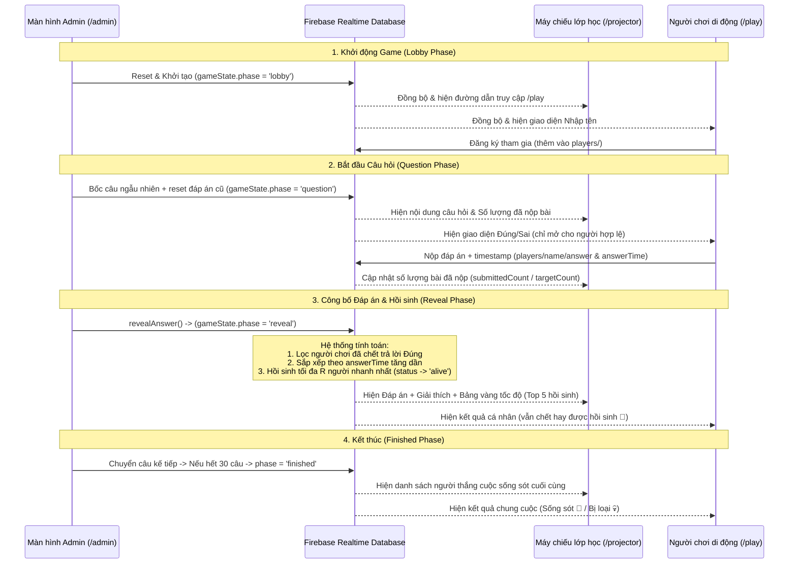

# Tài liệu Giải thích Mã nguồn Dự án - Game Trắc nghiệm Đúng/Sai Real-time (HCM202)

Tài liệu này cung cấp cái nhìn toàn diện và chi tiết về cấu trúc thư mục, luồng hoạt động, cơ chế cơ sở dữ liệu và các thành phần giao diện của ứng dụng game trắc nghiệm Đúng/Sai thời gian thực dành cho môn học Tư tưởng Hồ Chí Minh (HCM202).

---

## 1. Kiến trúc Tổng quan & Luồng Dữ liệu (Real-time Flow)

Ứng dụng được xây dựng trên nền tảng **Next.js (App Router)** kết hợp với **Firebase Realtime Database (RTDB)**. 

### Sơ đồ Luồng Hoạt động Real-time:



---

## 2. Cấu trúc Cơ sở Dữ liệu Firebase (Database Schema)

Cơ sở dữ liệu được tổ chức thành 2 nhánh chính ở gốc của Firebase Realtime Database:

### 2.1. Nhánh Trạng thái Game (`gameState`)
Lưu trữ trạng thái toàn cục điều khiển toàn bộ ứng dụng.

```json
{
  "gameState": {
    "phase": "lobby", // Các pha: 'lobby' | 'question' | 'reveal' | 'finished'
    "currentQuestion": 1, // Thứ tự câu hỏi hiện tại (1-indexed, tối đa 30)
    "activeQuestionId": 12, // ID thực tế của câu hỏi được bốc từ bộ câu hỏi (1-30)
    "resurrectionCount": 1, // Số lượng người chơi bị loại được hồi sinh tối đa mỗi câu (0, 1, 2, 3)
    "resurrectedThisRound": ["Nguyen Van A"], // Mảng tên những người chơi vừa được hồi sinh ở câu hiện tại
    "finalRound": false, // Cờ kích hoạt Vòng Chung Kết (Khóa hồi sinh, bắt trả lời ẩn danh trên web)
    "questionStartTime": 1717918234000, // Timestamp (ms) lúc câu hỏi bắt đầu hiển thị (để tính thời gian trả lời)
    "usedQuestionIds": {
      "12": true, // Đánh dấu ID câu hỏi đã được sử dụng để không bị trùng lặp
      "5": true
    }
  }
}
```

### 2.2. Nhánh Người chơi (`players`)
Lưu trữ thông tin chi tiết và hành vi của từng người tham gia. Mỗi người chơi được xác định bằng một định danh duy nhất được rút gọn ký tự đặc biệt (`sanitizeKey`).

```json
{
  "players": {
    "Nguyen_Van_A": {
      "name": "Nguyễn Văn A", // Tên hiển thị của người chơi
      "status": "alive", // Trạng thái: 'alive' (Còn sống) | 'dead' (Bị loại)
      "answer": true, // Đáp án nộp: true (ĐÚNG) | false (SAI) | null (Chưa trả lời)
      "answerTime": 1717918239500, // Timestamp (ms) lúc bấm nút nộp bài
      "joinedAt": 1717918200000 // Timestamp (ms) lúc tham gia phòng chờ
    }
  }
}
```

---

## 3. Luật chơi & Cơ chế Hybrid đặc thù

Dự án này sử dụng mô hình kết hợp (Hybrid) rất độc đáo nhằm tăng tính tương tác trực tiếp trong không gian lớp học:

### 3.1. Đối với người chơi còn sống (`alive`)
*   **Vòng loại (`finalRound === false`)**:
    *   Học sinh **không bấm điện thoại** để trả lời.
    *   Học sinh phải **hành động thực tế** trong lớp học (Ví dụ: Đứng lên tương ứng chọn ĐÚNG / Ngồi xuống tương ứng chọn SAI; hoặc di chuyển sang bên trái/phải lớp học).
    *   Màn hình điện thoại hiển thị thông báo động viên: *"Bạn đang còn sống, hãy chuẩn bị trả lời!"*.
*   **Vòng chung kết (`finalRound === true`)**:
    *   Lúc này tính năng Hồi sinh đã bị khóa hoàn toàn.
    *   Các học sinh còn sống bắt buộc phải **trả lời ẩn danh trên điện thoại** (giao diện hiện 2 nút Đúng/Sai).
    *   Nếu trả lời **sai** hoặc **không trả lời**, trạng thái của họ sẽ tự động bị chuyển sang bị loại (`dead`).

### 3.2. Đối với người chơi đã bị loại (`dead`)
*   **Vòng loại (`finalRound === false`)**:
    *   Điện thoại của học sinh sẽ hiển thị giao diện trả lời với 2 nút bấm **ĐÚNG** và **SAI**.
    *   Học sinh cần suy nghĩ và bấm chọn thật nhanh.
    *   **Công thức hồi sinh**: Khi Admin bấm công bố đáp án, hệ thống sẽ tự động tìm các người chơi có `status === "dead"`, có câu trả lời khớp với đáp án chính xác của câu hỏi, sắp xếp thời gian phản hồi (`answerTime - questionStartTime`) từ thấp đến cao. Sau đó lấy ra tối đa $R$ người (với $R$ là `resurrectionCount` do Admin thiết lập) nhanh nhất để đổi trạng thái thành `alive`.
*   **Vòng chung kết (`finalRound === true`)**:
    *   Không còn cơ hội hồi sinh. Người chơi bị loại sẽ ở chế độ **Khán giả** (Spectator mode) và chỉ có thể quan sát diễn biến trên điện thoại.

---

## 4. Cấu trúc thư mục & Ý nghĩa các file nguồn

```text
├── app/
│   ├── admin/
│   │   └── page.tsx           # Bảng điều khiển quản trị (quản lý câu hỏi, hồi sinh, kích người chơi)
│   ├── login/
│   │   ├── actions.ts         # Server Action kiểm tra mật khẩu Admin & set HttpOnly Cookie
│   │   └── page.tsx           # Trang đăng nhập dành cho Admin
│   ├── play/
│   │   └── page.tsx           # Trang giao diện dành cho Học sinh chơi trên điện thoại
│   ├── projector/
│   │   └── page.tsx           # Trang trình chiếu lớn trên máy chiếu lớp học
│   ├── globals.css            # Style toàn cục (Double Bezel, Spring transitions, Glows, keyframes)
│   ├── layout.tsx             # Cấu trúc HTML & Root Layout chính
│   └── page.tsx               # Trang chủ điều hướng các vai trò
├── components/
│   └── ui/
│       ├── GlassCard.tsx      # Component thẻ kính mờ thiết kế Viền kép (Double Bezel)
│       ├── PillButton.tsx     # Nút bấm dạng viên thuốc bo tròn kèm hiệu ứng scale đàn hồi
│       ├── StatusBadge.tsx    # Huy hiệu hiển thị trạng thái (CÒN SỐNG / BỊ LOẠI / ĐÃ HỒI SINH)
│       └── ResurrectionLeaderboard.tsx # Bảng vinh danh tốc độ hồi sinh (Top 5 trả lời nhanh)
├── lib/
│   ├── firebase.ts            # Cấu hình SDK Firebase & khởi tạo Realtime Database
│   ├── types.ts               # Định nghĩa các TypeScript interfaces (Player, GameState, GamePhase)
│   ├── questions.ts           # Kho lưu trữ 30 câu hỏi môn học HCM202 (Độ khó: easy/medium/hard)
│   └── game-actions.ts        # Chứa toàn bộ logic xử lý game (resetGame, joinGame, revealAnswer, nextQuestion...)
```

---

## 5. Phân tích chi tiết Logic trong file `lib/game-actions.ts`

Đây là file chứa các hàm xử lý trạng thái cốt lõi của toàn bộ trò chơi:

### 5.1. Hàm `revealAnswer` (Xử lý đáp án & Hồi sinh tự động)
Hàm này thực hiện các bước:
1. Lấy trạng thái game hiện tại từ `/gameState` và danh sách người chơi từ `/players`.
2. Đối chiếu đáp án thực tế của câu hỏi hiện tại.
3. Nếu đang là **Vòng Chung Kết** (`finalRound: true`):
   * Quét toàn bộ người chơi. Ai đang sống (`status === "alive"`) nhưng chọn đáp án **khác** đáp án chính xác hoặc chưa chọn (`answer === null`) sẽ bị cập nhật thành bị loại (`status = "dead"`).
4. Nếu đang là **Vòng Loại** (`finalRound: false`) và có thiết lập số người hồi sinh (`resurrectionCount > 0`):
   * Lọc ra tất cả người chơi đang bị loại (`status === "dead"`) trả lời **Đúng** câu hỏi và có ghi nhận thời gian trả lời (`answerTimeTime != null`).
   * Sắp xếp danh sách này theo thứ tự thời gian nộp bài tăng dần (ai nhanh hơn xếp trước): `(a, b) => a.answerTime - b.answerTime`.
   * Cắt lấy tối đa $R$ người chơi đầu tiên (`slice(0, resurrectionCount)`).
   * Chuyển trạng thái của họ thành `alive` và đưa tên của họ vào mảng `resurrectedThisRound` để vinh danh trên máy chiếu.
5. Cập nhật trạng thái game sang pha hiển thị đáp án (`phase = "reveal"`).

### 5.2. Hàm `nextQuestion` (Chuyển câu hỏi & Tự động bốc câu hỏi)
Hàm này được gọi khi Admin muốn chuyển sang câu tiếp theo:
1. Kiểm tra số lượng câu hỏi đã dùng. Nếu đã dùng hết 30 câu hỏi, chuyển game sang pha kết thúc (`phase = "finished"`).
2. Lọc ra danh sách các câu hỏi chưa sử dụng dựa theo độ khó được chọn (`easy` | `medium` | `hard`) và đối chiếu với bản ghi `usedQuestionIds`.
3. Nếu các câu hỏi ở độ khó được chọn đã được dùng hết, hệ thống tự động fallback lấy bất kỳ câu hỏi nào chưa sử dụng trong kho.
4. Bốc ngẫu nhiên một câu hỏi trong số các câu hợp lệ còn lại.
5. Tiến hành cập nhật trạng thái game:
   * Chuyển `phase` về `"question"`.
   * Tăng số thứ tự câu hỏi `currentQuestion` lên 1.
   * Gán `activeQuestionId` bằng ID câu hỏi mới bốc.
   * Cập nhật `questionStartTime` bằng thời gian hiện tại của máy chủ (`serverTimestamp()`).
   * Thêm ID câu hỏi mới vào danh sách `usedQuestionIds`.
6. Thực hiện xóa toàn bộ đáp án và thời gian nộp bài của mọi người chơi về `null` để chuẩn bị cho câu hỏi mới (`resetAllAnswers()`).

---

## 6. Thiết kế Giao diện & Trải nghiệm Người dùng (UI/UX)

Giao diện của ứng dụng được xây dựng theo triết lý hiện đại và có tính thẩm mỹ cao:

*   **Bảng màu (Color Palette)**: Nền tối sâu thẳm `#050505` giúp hiển thị rõ nét trên máy chiếu lớp học. Các điểm nhấn màu sắc có độ tương phản cao và hiệu ứng phát sáng mờ (`glow`):
    *   *Vàng hổ phách (`#f59e0b`)*: Đại diện cho sảnh chờ, tiến trình game và trạng thái hồi sinh.
    *   *Xanh ngọc (`#10b981`)*: Đại diện cho câu trả lời Đúng và trạng thái Còn sống.
    *   *Đỏ (`#ef4444`)*: Đại diện cho câu trả lời Sai, trạng thái Bị loại và Vòng chung kết.
*   **Double Bezel (Viền kép)**: Kết hợp đường viền ngoài mỏng nhẹ có bóng mờ (`bezel-outer`) lồng bên trong một khung nền đen đậm có viền trong phản chiếu ánh sáng nhẹ (`bezel-inner`). Đây là kỹ nghệ thiết kế giả lập giao diện phần cứng cao cấp.
*   **Hiệu ứng spring-physics**: Các nút bấm sử dụng chuyển động đường cong cubic-bezier đặc biệt (`cubic-bezier(0.32, 0.72, 0, 1)`) mang lại cảm giác phản hồi nhanh nhạy, nảy và cực kỳ êm ái khi tương tác trên thiết bị di động.
